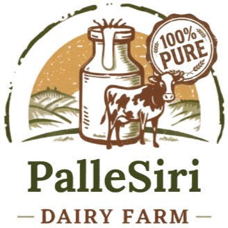

# 🐄 PalleSiri Dairy Farm

<div align="center">



### 🌿 Fresh Milk from Village to Your Doorstep

**100% Pure • No Adulteration • Direct from Farmers**

[](https://react.dev/)
[](https://vitejs.dev/)
[](https://tailwindcss.com/)
[]()

### 🌐 Live Website
https://pallesiridairyfarm.vercel.app/

</div>

---

# 📖 About

PalleSiri Dairy Farm is a modern dairy farm website designed to connect customers directly with fresh, high-quality dairy products sourced from local farmers.

The website showcases dairy products, enables quick ordering through WhatsApp, supports multiple languages, and provides essential farm information including location and contact details.

Our goal is to deliver **pure, healthy, and farm-fresh dairy products** while promoting sustainable dairy farming.

---

# ✨ Features

- 🥛 Beautiful modern landing page
- 🎥 Hero section with farm video
- 🐄 Product showcase
- 🌍 Multi-language support
  - English
  - हिन्दी
  - తెలుగు
- 📱 Direct WhatsApp ordering
- 📍 Google Maps integration
- 👤 Founder information
- 📷 Product image gallery
- ⚡ Fast loading using Vite
- 📱 Fully responsive layout

---

# 🛒 Products

- 🥛 Fresh Milk
- 🥣 Curd
- 🧀 Paneer
- 🧈 Ghee
- 🥤 Buttermilk

---

# 🛠 Tech Stack

| Technology | Usage |
|------------|-------|
| React | Frontend |
| Vite | Build Tool |
| Tailwind CSS | Styling |
| JavaScript | Programming Language |
| HTML5 | Structure |
| CSS3 | Styling |
| Vercel | Deployment |

---

# 📁 Project Structure

```
PalleSiri/
│
├── public/
│   ├── logo.png
│   ├── farm-video.mp4
│   ├── milk.jpg
│   ├── curd.jpg
│   ├── paneer.jpg
│   ├── ghee.jpg
│   ├── buttermilk.jpg
│   ├── owner.jpg
│   └── favicon.svg
│
├── src/
│   ├── App.jsx
│   ├── main.jsx
│   ├── index.css
│   └── assets/
│
├── package.json
├── vite.config.js
├── README.md
└── .gitignore
```

---

# 🚀 Getting Started

## Clone the Repository

```bash
git clone https://github.com/Jadav-Ruthwik/PalleSiri.git
```

Go inside the project

```bash
cd PalleSiri
```

Install dependencies

```bash
npm install
```

Run the development server

```bash
npm run dev
```

Build for production

```bash
npm run build
```

Preview production build

```bash
npm run preview
```

---

# 🌍 Website Sections

- Home
- About
- Products
- Contact
- WhatsApp Ordering
- Google Maps
- Founder Information
- Multi-language Support

---

# 🌐 Multi-language Support

The website supports three languages:

- 🇬🇧 English
- 🇮🇳 हिन्दी (Hindi)
- 🇮🇳 తెలుగు (Telugu)

Users can switch languages instantly using the language selector in the navigation bar.

---

# 📱 WhatsApp Ordering

Customers can order products directly through WhatsApp with pre-filled messages.

Example:

```
Hi, I want to order Milk from PalleSiri Dairy.
```

---

# 📍 Location

**PalleSiri Dairy Farm**

RAJARAM TANDA  
Turkwadgaon  
Telangana – 502286

Google Maps

https://maps.app.goo.gl/TYBu824FGR6BeCZT9

---

# 👤 Founder

**Rathod Venkatesh**

Founder

PalleSiri Dairy Farm

---

# 📞 Contact

📧 Email

pallesiridairy@gmail.com

📱 Phone

+91 70367 98322

🌐 Website

https://pallesiridairyfarm.vercel.app/

---

# 💡 Future Improvements

- Online Payment Integration
- Customer Login
- Daily Milk Subscription
- Admin Dashboard
- Inventory Management
- Delivery Tracking
- Customer Reviews
- AI Chatbot
- Online Billing
- Farm Gallery
- Blog Section
- SEO Optimization

---

# 🤝 Contributing

Contributions are welcome!

1. Fork the repository

2. Create your feature branch

```bash
git checkout -b feature/NewFeature
```

3. Commit your changes

```bash
git commit -m "Add New Feature"
```

4. Push to the branch

```bash
git push origin feature/NewFeature
```

5. Open a Pull Request

---

# 📜 License

This project is licensed under the MIT License.

---

# ❤️ Acknowledgements

Special thanks to the local farmers and everyone who supports fresh, natural, and sustainable dairy farming.

---

<div align="center">

## 🐄 PalleSiri Dairy Farm

### Pure Milk. Pure Trust.

**Fresh from Our Farm to Your Family.**

⭐ If you like this project, don't forget to star the repository!

Made with ❤️ using React + Vite + Tailwind CSS

</div>
